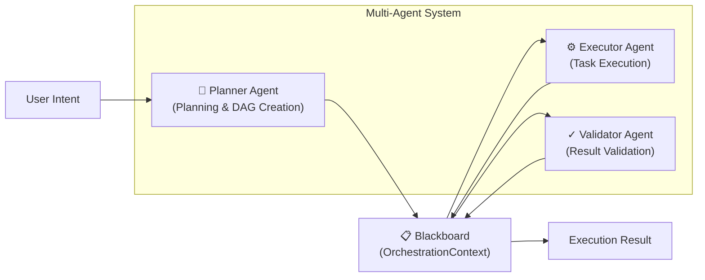
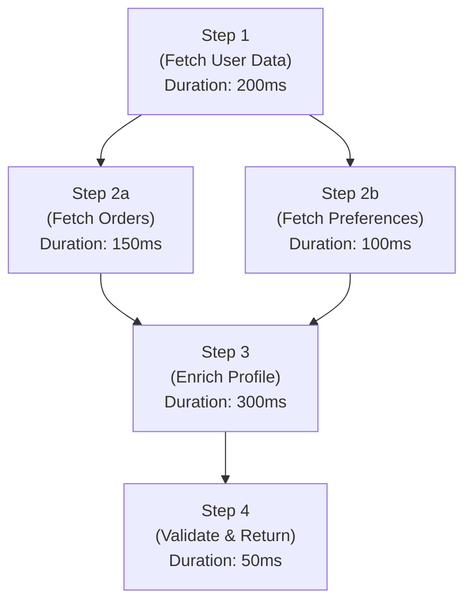
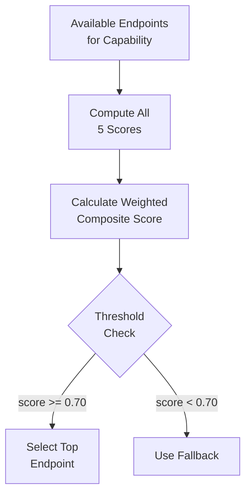
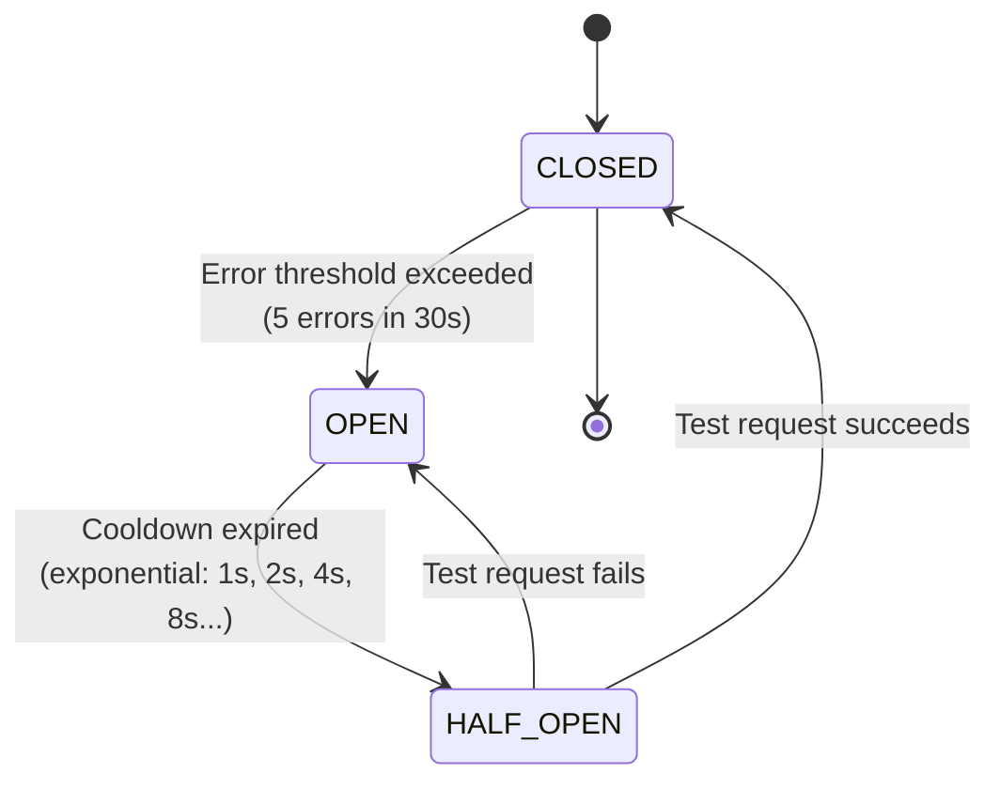
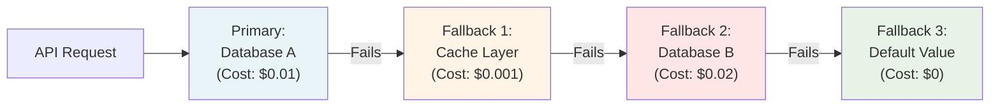

# AgentFlow Architecture Documentation

**Author:** Venkata Pavan Kumar Gummadi  
**Last Updated:** 2026-04-11  
**Project:** AgentFlow - AI-Powered Multi-Agent API Orchestration Framework

---

## Table of Contents

1. [Executive Summary](#executive-summary)
2. [High-Level Architecture](#high-level-architecture)
3. [Multi-Agent System](#multi-agent-system)
4. [DAG-Based Execution Model](#dag-based-execution-model)
5. [Dynamic Routing Engine](#dynamic-routing-engine)
6. [Resilience Layer](#resilience-layer)
7. [Connector Layer](#connector-layer)
8. [Event Journal and Audit Trail](#event-journal-and-audit-trail)
9. [Data Flow Examples](#data-flow-examples)
10. [Design Patterns and Principles](#design-patterns-and-principles)

---

## Executive Summary

AgentFlow is a sophisticated enterprise-grade API orchestration framework that enables autonomous multi-agent coordination through intelligent routing, adaptive resilience, and comprehensive observability. The system implements a layered architecture that separates concerns across five distinct layers, from high-level intent processing to low-level connector management.

**Core Innovation:** The framework combines directed acyclic graph (DAG) execution planning with dynamic, multi-dimensional routing decisions to enable optimal resource utilization, fault tolerance, and cost optimization in distributed API environments.

---

## High-Level Architecture

### Layered Architecture Overview

AgentFlow employs a five-layer architecture that processes requests from intent specification through to connector execution:

```
┌──────────────────────────────────────────────────────┐
│  Intent Layer                                        │
│  (Natural language, structured intent definition)    │
└──────────────────────────────────────────────────────┘
                          ↓
┌──────────────────────────────────────────────────────┐
│  Agent Orchestrator                                  │
│  (Planner, Executor, Validator agents)               │
└──────────────────────────────────────────────────────┘
                          ↓
┌──────────────────────────────────────────────────────┐
│  Dynamic Router                                      │
│  (5-dimensional scoring, endpoint selection)         │
└──────────────────────────────────────────────────────┘
                          ↓
┌──────────────────────────────────────────────────────┐
│  Resilience Layer                                    │
│  (Circuit breakers, retry policies, fallback chains)│
└──────────────────────────────────────────────────────┘
                          ↓
┌──────────────────────────────────────────────────────┐
│  Connector Layer                                     │
│  (API endpoint execution, protocol handling)         │
└──────────────────────────────────────────────────────┘
```

### Layer Responsibilities

| Layer | Purpose | Key Components |
|-------|---------|-----------------|
| **Intent** | Parse user requests into structured intent | Intent parser, semantic analyzer |
| **Orchestrator** | Plan and execute multi-step workflows | Planner, Executor, Validator agents |
| **Dynamic Router** | Select optimal endpoints based on multiple criteria | Scoring engine, endpoint registry |
| **Resilience** | Handle failures, retries, and fallbacks | Circuit breaker, retry policies |
| **Connector** | Execute API calls and protocol management | BaseConnector, protocol implementations |

---

## Multi-Agent System

### Agent-Based Orchestration Architecture

AgentFlow uses a three-agent system with a shared state mechanism called the **Blackboard Architecture** for coordinating complex workflows.



### Agent Roles and Responsibilities

#### 1. Planner Agent
- **Responsibility:** Transforms user intent into an executable DAG-based plan
- **Inputs:** User intent, available connectors, historical performance metrics
- **Outputs:** ExecutionPlan (DAG structure with step dependencies)
- **Key Capabilities:**
  - Dependency analysis and topological ordering
  - Cost estimation based on connector metrics
  - Parallel execution opportunity identification
  - Fallback chain planning

**Example Planning Logic:**
```
Input: "Fetch user data from Database A, enrich with API B, validate with Service C"
Output: 
  Step 1 (Parallel): Fetch from DB A
  Step 2 (Sequential): Enrich via API B (depends on Step 1)
  Step 3 (Sequential): Validate via Service C (depends on Step 2)
```

#### 2. Executor Agent
- **Responsibility:** Executes planned steps with intelligent routing and resilience handling
- **Inputs:** ExecutionPlan from Planner, current system state
- **Outputs:** Execution results, intermediate state updates, error handling decisions
- **Key Capabilities:**
  - Dynamic endpoint selection based on 5-dimensional scoring
  - Automatic retry logic with exponential backoff
  - Fallback activation when primary routes fail
  - Real-time performance metrics collection

#### 3. Validator Agent
- **Responsibility:** Validates execution results against defined criteria
- **Inputs:** Execution results, validation schemas, success criteria
- **Outputs:** Validation status, remediation suggestions, audit records
- **Key Capabilities:**
  - Schema validation and type checking
  - Business logic validation
  - Data integrity verification
  - Anomaly detection

### Blackboard Architecture (OrchestrationContext)

The **Blackboard** is a shared data structure that agents use for inter-agent communication and state management.

```
OrchestrationContext {
  ├── Request ID & Metadata
  │   ├── correlation_id: UUID
  │   ├── request_timestamp: ISO8601
  │   └── user_context: Dict[str, Any]
  │
  ├── Execution Plan
  │   ├── dag: DirectedAcyclicGraph
  │   ├── steps: Dict[StepID, ExecutionStep]
  │   └── dependencies: Dict[StepID, List[StepID]]
  │
  ├── Execution State
  │   ├── step_results: Dict[StepID, StepResult]
  │   ├── current_step: StepID
  │   ├── status: ExecutionStatus
  │   └── errors: List[ExecutionError]
  │
  ├── Routing Decisions
  │   ├── selected_endpoints: Dict[StepID, Endpoint]
  │   ├── routing_scores: Dict[StepID, Dict[Dimension, Float]]
  │   └── fallback_history: Dict[StepID, List[Endpoint]]
  │
  └── Event Journal
      ├── events: List[AuditEvent]
      ├── event_index: Dict[EventType, List[AuditEvent]]
      └── metrics: Dict[str, Metric]
```

**Blackboard Design Principles:**
- **Shared State**: All agents read/write to the same OrchestrationContext
- **Event-Driven**: Changes trigger event logging for complete audit trail
- **Immutable Events**: Historical events are append-only for auditability
- **Transactional Updates**: State changes are atomic and serializable

---

## DAG-Based Execution Model

### ExecutionPlan Structure

The ExecutionPlan represents a workflow as a directed acyclic graph where nodes are execution steps and edges represent data dependencies.



### Topological Ordering with Kahn's Algorithm

AgentFlow uses Kahn's algorithm to determine execution order and identify parallelizable steps:

**Algorithm Flow:**
```
1. Compute in-degree for all nodes (# of dependencies)
2. Initialize queue with all in-degree-0 nodes (no dependencies)
3. While queue not empty:
   a. Remove node from queue → add to execution order
   b. Decrement in-degree for all successor nodes
   c. If successor in-degree becomes 0, add to queue
4. Result: Linear execution order with parallel boundaries marked
```

**Time Complexity:** O(V + E) where V = steps, E = dependencies

### Parallel Execution Strategy

Steps with no inter-dependencies execute in parallel:

```
Execution Timeline:

T=0ms    [Step 1: Fetch User Data]
T=200ms  [Step 2a: Fetch Orders] [Step 2b: Fetch Preferences]  [parallel]
T=350ms  [Step 3: Enrich Profile]                                [waits for 2a & 2b]
T=650ms  [Step 4: Validate & Return]
T=700ms  ✓ Complete
```

**Resource Utilization:** By executing independent steps concurrently, AgentFlow reduces total latency from 700ms (serial) to 700ms (optimized parallelization).

### ExecutionStep Definition

```python
@dataclass
class ExecutionStep:
    step_id: str
    connector_type: str              # "database", "api", "service"
    operation: str                   # "query", "transform", "validate"
    input_mapping: Dict[str, str]    # {"param": "$.result.field"}
    dependencies: List[str]          # Step IDs this depends on
    timeout_ms: int = 5000
    retry_policy: RetryPolicy = default
    fallback_chain: List[Connector] = default
    
    # Metadata for scoring
    estimated_latency_p95: int       # milliseconds
    estimated_cost: float            # USD
    sla_requirement: Optional[SLA]
```

---

## Dynamic Routing Engine

### 5-Dimensional Scoring Framework

The Dynamic Router selects optimal endpoints using a multi-dimensional scoring system that balances performance, cost, availability, and capability match.

#### Scoring Dimensions

**1. Latency Score (P95 Percentile)**
- Measures: API response time at 95th percentile
- Weight: 0.25
- Formula: `score = 1 - min(latency_p95 / max_acceptable_latency, 1.0)`
- Example: P95=150ms, max=500ms → score = 0.70

**2. Cost-Per-Call Score**
- Measures: Monetary cost per request
- Weight: 0.20
- Formula: `score = 1 - min(cost / max_acceptable_cost, 1.0)`
- Example: Cost=$0.01, max=$0.10 → score = 0.90

**3. Rate-Limit Headroom Score**
- Measures: Available capacity before hitting rate limits
- Weight: 0.15
- Formula: `score = (remaining_quota / total_quota) * 0.5 + 0.5`
- Example: 800/1000 remaining → score = 0.90

**4. Semantic Capability Match Score**
- Measures: How well endpoint capabilities match request requirements
- Weight: 0.30
- Formula: `score = Σ(feature_match_score) / num_required_features`
- Example: Required 5 features, matched 4.5 → score = 0.90

**5. Health Score**
- Measures: Recent error rates and availability metrics
- Weight: 0.10
- Formula: `score = 1 - (recent_error_rate / historical_avg_error_rate)`
- Example: 2% error rate vs 5% historical → score = 0.60

#### Composite Scoring Formula

```
weighted_score = Σ (weight_i × dimension_score_i) for i in 1..5

Example Calculation:
  Latency Score:      0.70 × 0.25 = 0.175
  Cost Score:         0.90 × 0.20 = 0.180
  RateLimit Score:    0.90 × 0.15 = 0.135
  Semantic Score:     0.95 × 0.30 = 0.285
  Health Score:       0.85 × 0.10 = 0.085
  ────────────────────────────────
  TOTAL SCORE:                      0.860
```

#### Endpoint Selection Algorithm



**Selection Strategy:**
1. Filter endpoints by capability match (semantic score > 0.50)
2. Score remaining endpoints across 5 dimensions
3. Select highest-scoring endpoint if score ≥ 0.70
4. Otherwise, activate fallback chain

---

## Resilience Layer

The Resilience Layer provides three mechanisms for handling failures: circuit breakers, retry policies, and fallback chains.

### Circuit Breaker Pattern

The Circuit Breaker prevents cascading failures by actively blocking requests to failing services.

#### State Machine



#### State Descriptions

| State | Behavior | Transition |
|-------|----------|-----------|
| **CLOSED** | Normal operation, requests pass through | → OPEN when error threshold exceeded |
| **OPEN** | Reject requests immediately (fail-fast) | → HALF_OPEN after cooldown expires |
| **HALF_OPEN** | Allow limited test requests to probe recovery | → CLOSED if healthy, OPEN if still failing |

#### Exponential Cooldown Learning

```python
cooldown_sequence = [1, 2, 4, 8, 16, 32, 60]  # seconds

# After nth trip, cooldown = cooldown_sequence[min(n, len-1)]
# Example progression:
Trip 1: Wait 1s   → HALF_OPEN
Trip 2: Wait 2s   → HALF_OPEN
Trip 3: Wait 4s   → HALF_OPEN
Trip 4: Wait 8s   → HALF_OPEN
...
Trip 7+: Wait 60s → HALF_OPEN (plateau)

# Recovery: If HALF_OPEN request succeeds, reset to CLOSED
# Success in HALF_OPEN resets cooldown counter to 0
```

#### Configuration Example

```yaml
CircuitBreakerConfig:
  failure_threshold: 5          # errors to trigger OPEN
  window_size_seconds: 30       # time window for counting errors
  success_threshold: 2          # successes in HALF_OPEN to close
  cooldown_sequence:
    - 1
    - 2
    - 4
    - 8
    - 16
    - 32
    - 60
  monitored_exceptions:
    - TimeoutError
    - ConnectionError
    - 5xx HTTP responses
```

### Retry Policies

AgentFlow supports multiple retry strategies with adaptive backoff and jitter.

#### Retry Strategies

**1. Exponential Backoff**
```
delay = base_delay × (2 ^ attempt_number)
delay = 100ms × 2^0 = 100ms   (attempt 1)
delay = 100ms × 2^1 = 200ms   (attempt 2)
delay = 100ms × 2^2 = 400ms   (attempt 3)
delay = 100ms × 2^3 = 800ms   (attempt 4)
```

**2. Linear Backoff**
```
delay = base_delay × attempt_number
delay = 100ms × 1 = 100ms    (attempt 1)
delay = 100ms × 2 = 200ms    (attempt 2)
delay = 100ms × 3 = 300ms    (attempt 3)
```

**3. Fibonacci Backoff**
```
delay = base_delay × fibonacci(attempt_number)
delay = 100ms × F(1) = 100ms    (attempt 1)
delay = 100ms × F(2) = 100ms    (attempt 2)
delay = 100ms × F(3) = 200ms    (attempt 3)
delay = 100ms × F(4) = 300ms    (attempt 4)
delay = 100ms × F(5) = 500ms    (attempt 5)
```

**4. Adaptive Backoff with Jitter**
```
# Prevents thundering herd problem
delay = (base_delay × 2^attempt) + random(0, jitter_max)
jitter = 50ms

Example:
delay = (100ms × 2^0) + random(0, 50ms) = 100-150ms
delay = (100ms × 2^1) + random(0, 50ms) = 200-250ms
delay = (100ms × 2^2) + random(0, 50ms) = 400-450ms
```

#### Retry Policy Configuration

```yaml
RetryPolicy:
  strategy: "exponential"           # exponential, linear, fibonacci, adaptive
  max_attempts: 5
  base_delay_ms: 100
  max_delay_ms: 10000
  jitter_ms: 50
  
  # Idempotency key for safe retries
  idempotency_key: "{{ request.id }}"
  
  # Don't retry on these errors
  no_retry_errors:
    - InvalidInput
    - Unauthorized
    - NotFound
```

### Fallback Chains

When primary endpoints fail, AgentFlow activates fallback chains—ordered lists of alternative connectors.



#### Fallback Chain Semantics

```python
@dataclass
class FallbackChain:
    primary: Connector
    fallbacks: List[Connector]  # Ordered by preference
    
    # Configuration
    continue_on_error: bool = True
    circuit_breaker_sensitive: bool = True  # respect CB state
    
    # Metrics
    activation_count: Dict[int, int]  # index → activation count
    success_rate: Dict[int, float]    # index → success %
```

**Activation Rules:**
1. Try primary connector
2. If primary fails and circuit breaker not OPEN, retry per policy
3. After retries exhausted or circuit OPEN, activate fallback[0]
4. Repeat for each fallback in chain
5. If all fallbacks fail, propagate error

---

## Connector Layer

### BaseConnector Abstract Base Class

The Connector Layer provides a unified interface for API endpoints, databases, and external services.

```python
from abc import ABC, abstractmethod
from typing import Any, Dict, Optional

class BaseConnector(ABC):
    """
    Abstract base class for all connectors.
    Implementations handle specific API protocols and endpoint types.
    """
    
    def __init__(self, endpoint_config: Dict[str, Any]):
        self.endpoint_config = endpoint_config
        self.health_check_interval_ms = 30000
        self.last_health_check = None
        self.circuit_breaker = CircuitBreaker(self)
    
    @abstractmethod
    async def execute(
        self,
        operation: str,
        parameters: Dict[str, Any],
        timeout_ms: int = 5000
    ) -> ExecutionResult:
        """
        Execute an operation against the endpoint.
        
        Args:
            operation: The operation name (e.g., "query", "create")
            parameters: Operation parameters
            timeout_ms: Request timeout in milliseconds
            
        Returns:
            ExecutionResult with data and metadata
        """
        pass
    
    @abstractmethod
    async def health_check(self) -> HealthStatus:
        """
        Verify endpoint availability and basic connectivity.
        
        Returns:
            HealthStatus indicating availability, latency, and errors
        """
        pass
    
    @abstractmethod
    def get_capabilities(self) -> ConnectorCapabilities:
        """
        Return capabilities, limitations, and feature support.
        
        Returns:
            ConnectorCapabilities describing what this connector can do
        """
        pass
    
    def get_metrics(self) -> ConnectorMetrics:
        """Get current performance metrics and health indicators."""
        return ConnectorMetrics(
            latency_p95_ms=self.circuit_breaker.latency_p95,
            error_rate=self.circuit_breaker.error_rate,
            success_rate=self.circuit_breaker.success_rate,
            availability=self.circuit_breaker.availability,
            cost_per_call=self.endpoint_config.get("cost_per_call", 0.0)
        )
```

### Connector Implementations

AgentFlow provides implementations for common endpoint types:

| Connector Type | Use Case | Protocol | Auth |
|---|---|---|---|
| **HTTPConnector** | REST APIs | HTTP/HTTPS | OAuth, API Key, JWT |
| **DatabaseConnector** | SQL databases | JDBC/ODBC | Username/Password, IAM |
| **GraphQLConnector** | GraphQL APIs | HTTP/HTTPS | OAuth, Custom headers |
| **EventConnector** | Event streams | gRPC, AMQP | mTLS, API Key |
| **MuleSoftConnector** | MuleSoft integration | HTTPS | MuleSoft OAuth |

### API Endpoint Discovery

Endpoints are discovered and registered dynamically:

```yaml
# Endpoint Registry Configuration
endpoints:
  - name: "user_db_primary"
    type: "database"
    connector_class: "DatabaseConnector"
    host: "db-primary.internal.company.com"
    port: 5432
    database: "users"
    capabilities: ["query", "insert", "update"]
    metrics:
      estimated_latency_p95_ms: 150
      estimated_cost_per_call: 0.001
      rate_limit: 10000  # requests/minute
    health_check:
      enabled: true
      interval_ms: 30000
      timeout_ms: 2000
  
  - name: "user_db_fallback"
    type: "database"
    connector_class: "DatabaseConnector"
    host: "db-fallback.internal.company.com"
    port: 5432
    capabilities: ["query"]  # read-only fallback
    metrics:
      estimated_latency_p95_ms: 250
      estimated_cost_per_call: 0.0005  # cheaper fallback

  - name: "user_cache"
    type: "cache"
    connector_class: "RedisConnector"
    host: "cache-01.internal.company.com"
    port: 6379
    ttl_seconds: 3600
    capabilities: ["query"]
    metrics:
      estimated_latency_p95_ms: 20
      estimated_cost_per_call: 0.0001
```

### MuleSoft Anypoint Integration

AgentFlow integrates with MuleSoft Anypoint for enterprise API management:

```python
class MuleSoftConnector(BaseConnector):
    """
    Connector for MuleSoft Anypoint Platform.
    Provides access to MuleSoft-managed APIs with governance.
    """
    
    def __init__(self, endpoint_config: Dict[str, Any]):
        super().__init__(endpoint_config)
        self.anypoint_client = AnyPointClient(
            org_id=endpoint_config["org_id"],
            client_id=endpoint_config["client_id"],
            client_secret=endpoint_config["client_secret"]
        )
    
    async def execute(
        self,
        operation: str,
        parameters: Dict[str, Any],
        timeout_ms: int = 5000
    ) -> ExecutionResult:
        """
        Execute operation via MuleSoft Anypoint.
        Respects SLAs, rate limits, and policies defined in Anypoint.
        """
        # Fetch API from Anypoint API registry
        api_spec = await self.anypoint_client.get_api(
            api_name=self.endpoint_config["api_name"],
            version=self.endpoint_config["api_version"]
        )
        
        # Build request respecting Anypoint policies
        request = self.build_request(
            api_spec=api_spec,
            operation=operation,
            parameters=parameters
        )
        
        # Execute with Anypoint OAuth
        token = await self.anypoint_client.get_access_token()
        response = await self.execute_request(
            request,
            auth_token=token,
            timeout_ms=timeout_ms
        )
        
        return ExecutionResult.from_response(response)
    
    async def health_check(self) -> HealthStatus:
        """Check API availability via Anypoint."""
        try:
            response = await self.anypoint_client.ping_api(
                api_name=self.endpoint_config["api_name"]
            )
            return HealthStatus.healthy(latency_ms=response.latency_ms)
        except Exception as e:
            return HealthStatus.unhealthy(error=str(e))
```

---

## Event Journal and Audit Trail

### OrchestrationContext Event System

Every action in AgentFlow creates an immutable audit event in the event journal for complete traceability.

#### EventType Enumeration

```python
class EventType(Enum):
    # Execution lifecycle
    ORCHESTRATION_STARTED = "orchestration.started"
    PLAN_CREATED = "plan.created"
    STEP_STARTED = "step.started"
    STEP_COMPLETED = "step.completed"
    STEP_FAILED = "step.failed"
    ORCHESTRATION_COMPLETED = "orchestration.completed"
    ORCHESTRATION_FAILED = "orchestration.failed"
    
    # Routing decisions
    ENDPOINT_EVALUATED = "endpoint.evaluated"
    ENDPOINT_SELECTED = "endpoint.selected"
    FALLBACK_ACTIVATED = "fallback.activated"
    
    # Resilience events
    RETRY_ATTEMPT = "retry.attempt"
    CIRCUIT_BREAKER_OPENED = "circuit_breaker.opened"
    CIRCUIT_BREAKER_CLOSED = "circuit_breaker.closed"
    CIRCUIT_BREAKER_HALF_OPEN = "circuit_breaker.half_open"
    
    # Validation
    VALIDATION_PASSED = "validation.passed"
    VALIDATION_FAILED = "validation.failed"
    
    # Errors
    ERROR_OCCURRED = "error.occurred"
    TIMEOUT_OCCURRED = "timeout.occurred"
```

#### AuditEvent Structure

```python
@dataclass
class AuditEvent:
    # Identity
    event_id: str                    # UUID
    orchestration_id: str            # Correlation ID
    timestamp: datetime              # ISO 8601
    event_type: EventType
    
    # Context
    step_id: Optional[str]           # Current execution step
    connector_name: Optional[str]    # Connector being used
    user_id: Optional[str]           # Request originator
    
    # Data
    message: str                     # Human-readable description
    details: Dict[str, Any]          # Type-specific metadata
    severity: str                    # "INFO", "WARN", "ERROR"
    
    # Metrics
    duration_ms: Optional[int]       # Operation duration
    cost_incurred: Optional[float]   # Monetary cost
    
    def to_json(self) -> str:
        """Serialize for audit storage."""
        return json.dumps(asdict(self), default=str)
```

### Event Journal Storage and Querying

```python
class EventJournal:
    """
    Append-only event log for complete audit trail.
    Immutable historical record of all orchestration events.
    """
    
    def __init__(self, storage_backend: StorageBackend):
        self.events: List[AuditEvent] = []
        self.event_index: Dict[EventType, List[AuditEvent]] = defaultdict(list)
        self.storage = storage_backend
    
    def append_event(self, event: AuditEvent) -> None:
        """Append immutable event to journal."""
        self.events.append(event)
        self.event_index[event.event_type].append(event)
        self.storage.persist(event)
    
    def query_events(
        self,
        event_type: Optional[EventType] = None,
        step_id: Optional[str] = None,
        time_range: Optional[Tuple[datetime, datetime]] = None
    ) -> List[AuditEvent]:
        """Query events with multiple filters."""
        results = self.events
        
        if event_type:
            results = self.event_index.get(event_type, [])
        
        if step_id:
            results = [e for e in results if e.step_id == step_id]
        
        if time_range:
            start, end = time_range
            results = [e for e in results if start <= e.timestamp <= end]
        
        return results
    
    def get_execution_timeline(self) -> str:
        """Generate human-readable timeline of execution."""
        timeline = []
        for event in self.events:
            timeline.append(
                f"{event.timestamp}: {event.event_type.value} - {event.message}"
            )
        return "\n".join(timeline)
```

### Example Audit Trail

```
[2026-04-11T14:32:15.123Z] orchestration.started - Orchestration ID: orch-789
[2026-04-11T14:32:15.145Z] plan.created - 4 steps in DAG, 2 parallel boundaries
[2026-04-11T14:32:15.156Z] step.started - step_id: fetch_user, connector: user_db_primary
[2026-04-11T14:32:15.289Z] endpoint.evaluated - database_A score: 0.85, database_B score: 0.72
[2026-04-11T14:32:15.290Z] endpoint.selected - Selected: database_A (score: 0.85)
[2026-04-11T14:32:15.421Z] step.completed - fetch_user completed in 265ms, cost: $0.001
[2026-04-11T14:32:15.422Z] step.started - step_id: enrich_data, connector: api_enrichment
[2026-04-11T14:32:15.650Z] step.completed - enrich_data completed in 228ms, cost: $0.015
[2026-04-11T14:32:15.651Z] validation.passed - Result validation passed
[2026-04-11T14:32:15.652Z] orchestration.completed - Total duration: 529ms, total cost: $0.016
```

---

## Data Flow Examples

### Example 1: Simple Sequential Flow with Fallback

**User Intent:** "Fetch the latest order for customer ID 12345"

**Execution Flow:**

```
1. PLANNER AGENT
   Input: Customer ID 12345
   → Creates ExecutionPlan:
     Step 1: Query Orders Database
     (no dependencies, ready to execute)

2. EXECUTOR AGENT with DYNAMIC ROUTER
   → Evaluate endpoints:
     - orders_db_primary: score 0.87 (preferred)
     - orders_cache: score 0.65 (fallback)
   
   → Select orders_db_primary (score > 0.70)
   
   → Execute query:
     DB responds with latency 145ms
     Result: Order{id: 54321, status: "shipped"}
   
   Event: STEP_COMPLETED, duration: 145ms, cost: $0.001

3. VALIDATOR AGENT
   Input: Order record
   → Validate schema: ✓ PASS
   → Validate business logic: ✓ PASS
   
   Event: VALIDATION_PASSED

4. OUTPUT
   ✓ Order found: Order{id: 54321, status: "shipped"}
   Total latency: 145ms
   Total cost: $0.001
```

### Example 2: Complex DAG with Fallback Activation

**User Intent:** "Enrich customer profile with purchase history and recommendations"

**Execution Flow:**

```
PLANNING PHASE:
  Step 1: Fetch User Profile      (no deps)
  Step 2a: Fetch Purchase History  (depends on Step 1)
  Step 2b: Fetch Preferences       (depends on Step 1)
  Step 3: Generate Recommendations (depends on 2a & 2b)

EXECUTION TIMELINE:

T=0ms:    [Executor] Start Step 1: Fetch User Profile
T=0ms:    [Router] Evaluate endpoints for profile service
          - profile_db_primary: 0.82
          - profile_cache: 0.65
          Selected: profile_db_primary
          
T=85ms:   [Step 1 Result] User profile fetched (latency: 85ms)
          Event: STEP_COMPLETED

T=85ms:   [Executor] Start Step 2a & 2b (parallel, both depend on 1)
T=85ms:   [Router] Evaluate for purchase history
          - orders_db: 0.88
          Selected: orders_db
          
T=85ms:   [Router] Evaluate for preferences
          - preferences_cache: 0.90
          Selected: preferences_cache

T=140ms:  [Step 2b Result] Preferences fetched (latency: 55ms)
          Event: STEP_COMPLETED

T=220ms:  [Step 2a Result] Purchase history fetched (latency: 135ms)
          Event: STEP_COMPLETED

T=220ms:  [Executor] Start Step 3: Generate Recommendations
T=220ms:  [Router] Evaluate recommendation engine
          - ml_service_primary: Evaluating...
          - ml_service_primary: Circuit breaker is OPEN!
          Event: CIRCUIT_BREAKER_OPENED
          → Fallback activated
          
T=220ms:  [Router] Try fallback: ml_service_backup
          - ml_service_backup: 0.75
          Selected: ml_service_backup
          Event: FALLBACK_ACTIVATED

T=520ms:  [Step 3 Result] Recommendations generated (latency: 300ms)
          Event: STEP_COMPLETED

T=520ms:  [Validator] Validate enriched profile
          Event: VALIDATION_PASSED

T=520ms:  [Final Result]
          ✓ Orchestration completed
          Total latency: 520ms
          Total cost: $0.0245
          Endpoints used: 4
          Fallbacks activated: 1
```

---

## Design Patterns and Principles

### Architectural Patterns Employed

#### 1. **Agent-Based Architecture**
- Separates planning, execution, and validation concerns
- Enables independent scaling of agent types
- Supports future addition of specialized agents (caching agent, optimization agent)

#### 2. **Blackboard Pattern**
- Shared state through OrchestrationContext
- Event-driven updates propagate across agents
- Maintains complete auditability

#### 3. **Circuit Breaker Pattern**
- Prevents cascading failures
- Fast-fail when services are unhealthy
- Auto-recovery with exponential backoff

#### 4. **Strategy Pattern**
- Multiple retry strategies (exponential, linear, Fibonacci)
- Multiple routing strategies (performance, cost, availability)
- Runtime selection based on context

#### 5. **Chain of Responsibility**
- Fallback chains handle sequential error recovery
- Each connector tries, then passes to next if failed
- Continues until success or all options exhausted

### SOLID Principles

| Principle | Implementation |
|-----------|-----------------|
| **Single Responsibility** | Each agent has one job; connectors encapsulate endpoint logic |
| **Open/Closed** | New connector types extend BaseConnector without modifying core |
| **Liskov Substitution** | All connectors conform to BaseConnector contract |
| **Interface Segregation** | Agents depend on minimal required interfaces |
| **Dependency Inversion** | High-level modules depend on abstractions (BaseConnector), not concretions |

### Scalability Considerations

**Horizontal Scaling:**
- Stateless Executor agents can scale independently
- Planner agents can process multiple orchestrations concurrently
- Validator agents scale with validation workload

**Vertical Scaling:**
- Blackboard state can be stored in distributed cache (Redis, etc.)
- Event journal can be offloaded to append-only log store (Kafka, etc.)
- Metrics collected in time-series database (Prometheus, etc.)

**Performance Optimization:**
- DAG parallelization reduces sequential latency
- Multi-dimensional routing prevents bottlenecks
- Caching strategies reduce repeated computations
- Adaptive retry backoff reduces network storms

---

## Conclusion

AgentFlow represents a sophisticated synthesis of multi-agent orchestration, intelligent routing, and resilience patterns. By combining DAG-based execution planning with dynamic endpoint selection and comprehensive auditing, the framework enables organizations to build robust, cost-effective, and observable API orchestration systems.

The five-layer architecture provides clear separation of concerns while the Blackboard-based agent coordination ensures state consistency and auditability. The resilience mechanisms (circuit breakers, adaptive retry policies, fallback chains) handle failure scenarios gracefully, while the event journal provides complete transparency into system behavior.

---

**Document Version:** 1.0  
**Last Reviewed:** 2026-04-11  
**Author:** Venkata Pavan Kumar Gummadi
